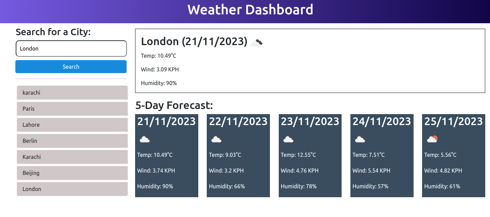

# Weather Dashboard

## Overview

This is a weather forecast application that enables users to access weather predictions for a selected city of their choice.On initial page load, the weather forecast will default to London's statistics.

## Website visuals

The following image shows the web application's appearance and functionality:

## Technologies

- HTML
- CSS
- Bootstrap
- jQuery
- Javascript

## Website

[https://github.com/ahmadsaqib1/weather-dashboard](https://ahmadsaqib1.github.io/weather-dashboard/)

## Contributions

Made by Ahmad Saqib
